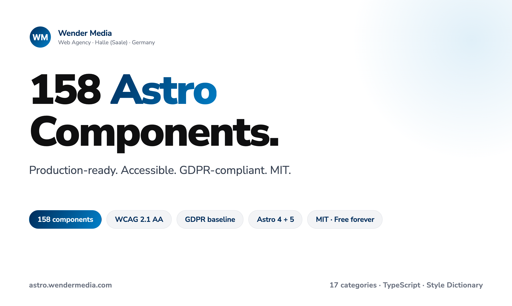
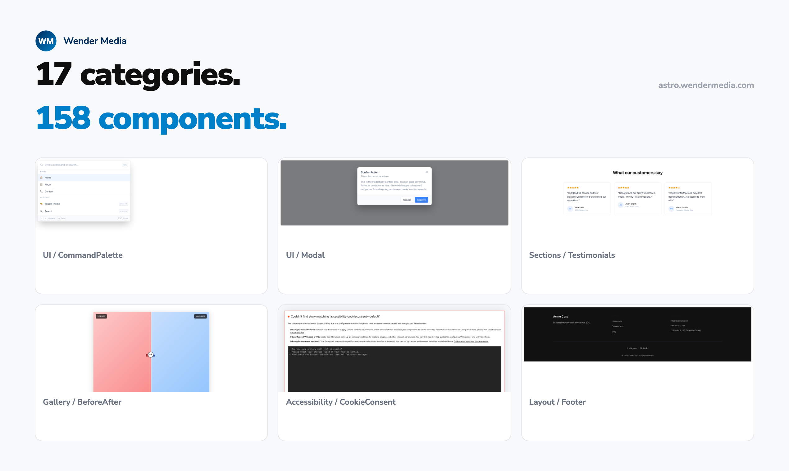
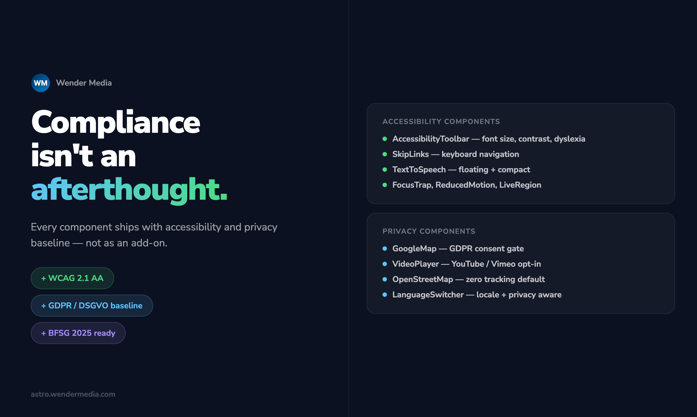

<p align="center">
  
</p>

<h1 align="center">@wendermedia/astro-components</h1>

<p align="center">
  <strong>158 production-ready, accessible, GDPR-compliant Astro components</strong><br />
  Built by <a href="https://www.wendermedia.com">Wender Media</a> &mdash; Web Agency from Halle (Saale), Germany
</p>

<p align="center">
  <a href="https://github.com/arnoldwender/wm-project-astro-components/blob/main/LICENSE"></a>
  
  
  
  
  
  
</p>

<p align="center">
  
</p>

<p align="center">
  
  
</p>

<p align="center">
  <a href="https://astro.wendermedia.com">Live Playbook</a> &bull;
  <a href="#installation">Installation</a> &bull;
  <a href="#quick-start">Quick Start</a> &bull;
  <a href="#components">Components</a> &bull;
  <a href="#design-tokens">Design Tokens</a> &bull;
  <a href="#contributing">Contributing</a>
</p>

<p align="center">
  <strong>Interactive component playbook:</strong> <a href="https://astro.wendermedia.com">astro.wendermedia.com</a><br />
  Browse all 158 components with live previews, props, and usage examples (Storybook).
</p>

---

## Features

- **158 Components** across 17 categories, ready for production
- **WCAG 2.1 AA Compliant** with full accessibility support and BFSG 2025 readiness
- **GDPR/DSGVO Ready** with privacy-first design and consent management
- **TypeScript First** with complete type definitions for all components
- **Design Token System** powered by Style Dictionary for consistent theming
- **Dark Mode Support** via CSS custom properties
- **Zero Third-Party Tracking** by default
- **Astro 4.x & 5.x** compatible with View Transitions and Content Collections
- **Framework Integrations** for React, Vue, Svelte, and Solid
- **WordPress Headless CMS** integration included

## Installation

```bash
npm install @wendermedia/astro-components
```

Or install directly from GitHub:

```bash
npm install git+https://github.com/arnoldwender/wm-project-astro-components.git
```

### CLI Scaffolding

```bash
# Create a new project with pre-configured templates
npx @wendermedia/astro-components create my-project

# With a specific template
npx @wendermedia/astro-components create my-shop --template=ecommerce

# List available templates
npx @wendermedia/astro-components list
```

#### Available Templates

| Template | Description |
|----------|-------------|
| `default` | Full-featured with all components |
| `minimal` | Lightweight with core components |
| `ecommerce` | Optimized for online shops |
| `blog` | Content-focused with SEO |
| `landing` | Single-page marketing sites |

## Quick Start

```astro
---
import { SEO } from '@wendermedia/astro-components/seo';
import { Header, Footer } from '@wendermedia/astro-components/layout';
import { CookieConsent } from '@wendermedia/astro-components/accessibility';
---

<!DOCTYPE html>
<html lang="en">
  <head>
    <SEO
      title="My Site"
      description="Built with @wendermedia/astro-components"
      siteName="My Site"
    />
  </head>
  <body>
    <Header
      navItems={[
        { label: 'Home', href: '/' },
        { label: 'About', href: '/about' },
      ]}
      siteName="My Site"
    />

    <main>
      <slot />
    </main>

    <Footer siteName="My Site" />
    <CookieConsent />
  </body>
</html>
```

## Components

### Overview (17 Categories, 158 Components)

| Category | Components | Import Path |
|----------|-----------|-------------|
| **Layout** | Header, Footer, Container, Grid, Section | `@wendermedia/astro-components/layout` |
| **Layouts** | Bento, Magazine, Dashboard, Portfolio, Newspaper, Split, Landing, Article, Docs, HeroLayout, ProductGrid | `@wendermedia/astro-components/layouts` |
| **SEO** | SEOHead, SchemaOrg/JsonLD, OpenGraph, TwitterCard, Canonical, RichSnippets, HreflangTags, Breadcrumbs | `@wendermedia/astro-components/seo` |
| **Accessibility** | CookieConsent, SkipLinks, FontResizer, ThemeToggle, BackToTop, FocusTrap, LanguageSwitcher, TextToSpeech, ScreenReaderOnly, LiveRegion, ReducedMotion, AccessibilityToolbar | `@wendermedia/astro-components/accessibility` |
| **Navigation** | Breadcrumbs, Pagination, MobileNav, Sidebar | `@wendermedia/astro-components/navigation` |
| **UI** | Accordion, Alert, Avatar, Badge, CommandPalette, Drawer, Dropdown, Modal, NewsTicker, Progress, Skeleton, Tabs, Toast, Tooltip | `@wendermedia/astro-components/ui` |
| **Sections** | Hero, CTA, Pricing, Team, Testimonials, FAQ, Features, Stats, Blog, Gallery, Contact, Timeline, Awards, Careers, CaseStudy, Comparison, Integrations, LogoCloud, Maintenance, Newsletter, Search, Video, and more | `@wendermedia/astro-components/sections` |
| **E-commerce** | Cart, ProductCard, ProductQuickView, Wishlist, AddToCartButton | `@wendermedia/astro-components/ecommerce` |
| **Forms** | ContactForm, Contact, Newsletter | `@wendermedia/astro-components/forms` |
| **Media** | VideoPlayer (YouTube/Vimeo/native), AudioPlayer, ImageGallery | `@wendermedia/astro-components/media` |
| **Maps** | GoogleMap (GDPR), OpenStreetMap | `@wendermedia/astro-components/maps` |
| **Gallery** | BeforeAfter (image comparison slider) | `@wendermedia/astro-components/gallery` |
| **Images** | OptimizedImage | `@wendermedia/astro-components/images` |
| **Products** | ProductCard (affiliate) | `@wendermedia/astro-components/products` |
| **Social** | SocialShare, SocialFollow | `@wendermedia/astro-components/social` |
| **Content** | ReadingProgress, ShareBar, TableOfContents | `@wendermedia/astro-components/content` |
| **Design System** | DesignSystemProvider, tokens, base styles, utilities | `@wendermedia/astro-components/design-system` |

### Component Examples

#### GDPR-Compliant Video Player

```astro
---
import { VideoPlayer } from '@wendermedia/astro-components/media';
---

<!-- YouTube with consent gate -->
<VideoPlayer
  provider="youtube"
  videoId="dQw4w9WgXcQ"
  title="Video Title"
  requireConsent={true}
  consentMessage="By playing, you agree to data processing by YouTube."
/>

<!-- Self-hosted video -->
<VideoPlayer
  src="/videos/intro.mp4"
  poster="/images/poster.jpg"
  controls={true}
/>
```

#### E-commerce Cart

```astro
---
import { Cart, ProductCard } from '@wendermedia/astro-components/ecommerce';
---

<ProductCard
  id="prod-001"
  name="Premium Headphones"
  price={149.99}
  image="/headphones.jpg"
  showWishlist={true}
  showQuickView={true}
/>

<Cart currency="EUR" locale="de-DE" checkoutUrl="/checkout" />
```

#### Breadcrumbs with Schema.org

```astro
---
import { Breadcrumbs } from '@wendermedia/astro-components/navigation';
---

<Breadcrumbs
  items={[
    { name: 'Home', url: '/' },
    { name: 'Products', url: '/products' },
    { name: 'Headphones', url: '/products/headphones' },
  ]}
  showSchema={true}
/>
```

#### Cookie Consent (GDPR)

```astro
---
import { CookieConsent } from '@wendermedia/astro-components/accessibility';
---

<CookieConsent
  showSettings={true}
  analyticsEnabled={false}
  marketingEnabled={false}
  privacyUrl="/datenschutz"
  position="bottom"
/>
```

## Design Tokens

Centralized design system powered by [Style Dictionary](https://amzn.github.io/style-dictionary/):

```bash
npm run tokens:build
```

### Using Tokens

```css
/* CSS Custom Properties */
@import '@wendermedia/astro-components/tokens/dist/tokens.css';

.button {
  background: var(--color-brand-primary);
  padding: var(--space-4) var(--space-8);
  border-radius: var(--border-radius-lg);
}
```

```typescript
// JavaScript / TypeScript
import { tokens } from '@wendermedia/astro-components/tokens';

const primaryColor = tokens.color.brand.primary.value;
```

```scss
// SCSS
@use '@wendermedia/astro-components/tokens/dist/tokens';

.button {
  background: tokens.$color-brand-primary;
}
```

## Testing

```bash
# Unit tests
npm run test

# With coverage
npm run test:coverage

# Accessibility tests (axe-core)
npm run test:a11y
```

### Testing Utilities

```typescript
import {
  runA11yAudit,
  expectNoA11yViolations,
} from '@wendermedia/astro-components/testing';

describe('MyComponent', () => {
  it('has no accessibility violations', async () => {
    const element = document.querySelector('.my-component');
    await expectNoA11yViolations(element);
  });
});
```

## Storybook

Browse all 158 components interactively at **[astro.wendermedia.com](https://astro.wendermedia.com)**.

Run locally:

```bash
npm run storybook        # Start dev server on port 6006
npm run build-storybook  # Build static site
```

## WordPress Integration

Connect to WordPress as a headless CMS:

```typescript
import {
  createWordPressClient,
  fetchPosts,
  fetchMenus,
} from '@wendermedia/astro-components/integrations/wordpress';

const wp = createWordPressClient({
  url: 'https://your-wordpress-site.com',
});

const posts = await fetchPosts(wp, { perPage: 10 });
const menu = await fetchMenus(wp);
```

See the [WordPress Integration Guide](./integrations/wordpress/README.md) for full documentation.

## Project Structure

```
@wendermedia/astro-components/
  src/
    accessibility/     # A11y components
    content/           # Content components
    design-system/     # Base styles & tokens
    ecommerce/         # E-commerce components
    forms/             # Form components
    gallery/           # Gallery components
    images/            # Image optimization
    layout/            # Layout components
    layouts/           # Page layout templates
    maps/              # Map components
    media/             # Media players
    navigation/        # Navigation components
    products/          # Product display
    sections/          # Section templates
    seo/               # SEO components
    social/            # Social components
    ui/                # UI primitives
  integrations/        # Framework integrations (React, Vue, Svelte, Solid, WordPress)
  tokens/              # Design tokens (Style Dictionary)
  testing/             # Test utilities
  cli/                 # CLI scaffolding tool
  templates/           # Project templates
  docs/                # Documentation
```

## Requirements

- **Astro** 4.x or 5.x
- **Node.js** 18+
- **TypeScript** 5.x (recommended)

### Optional Peer Dependencies

- `@astrojs/react` - React island support
- `@astrojs/vue` - Vue island support
- `@astrojs/svelte` - Svelte island support
- `@astrojs/solid-js` - Solid island support
- `GSAP` - Hero animations

## Browser Support

- Chrome / Edge 90+
- Firefox 90+
- Safari 14+
- iOS Safari / Chrome Android

## Contributing

We welcome contributions! Please read our [Contributing Guide](./CONTRIBUTING.md) before submitting a Pull Request.

1. Fork the repository
2. Create a feature branch: `git checkout -b feat/amazing-feature`
3. Make your changes following the [coding standards](./CONTRIBUTING.md#coding-standards)
4. Run tests: `npm run test`
5. Add a changeset: `npm run changeset`
6. Submit a Pull Request

Please also review our [Code of Conduct](./CODE_OF_CONDUCT.md).

## Versioning

We use [Changesets](https://github.com/changesets/changesets) for version management:

```bash
npm run changeset       # Add a changeset
npm run version         # Update versions
npm run release         # Publish release
```

See [CHANGELOG.md](./CHANGELOG.md) for release history.

## Author

**Arnold Wender**
- Website: [arnoldwender.com](https://arnoldwender.com)
- Agency: [Wender Media](https://www.wendermedia.com) - Web Agency, Halle (Saale), Germany
- GitHub: [@arnoldwender](https://github.com/arnoldwender)
- Twitter/X: [@arnoldwender](https://x.com/arnoldwender)
- LinkedIn: [arnoldwender](https://linkedin.com/in/arnoldwender)

## License

This project is licensed under the [MIT License](./LICENSE).

Copyright (c) 2007-2026 [Wender Media](https://www.wendermedia.com) - Arnold Wender.

---

<p align="center">
  Made with care by <a href="https://www.wendermedia.com">Wender Media</a> in Halle (Saale), Germany
</p>


---

## Disclaimer

If you are a racist, fascist, or extremist of any kind or have another kind of mental disability that makes you discriminate against other human beings — please don't use my software.
